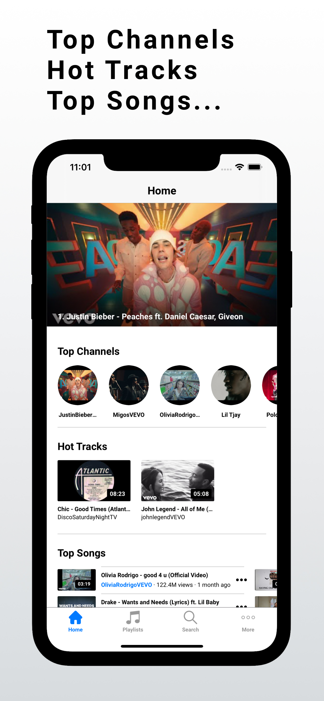
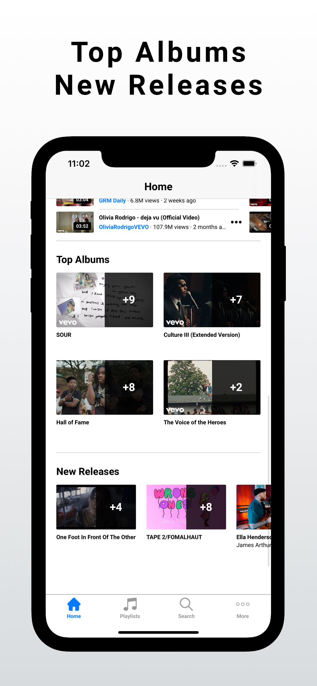
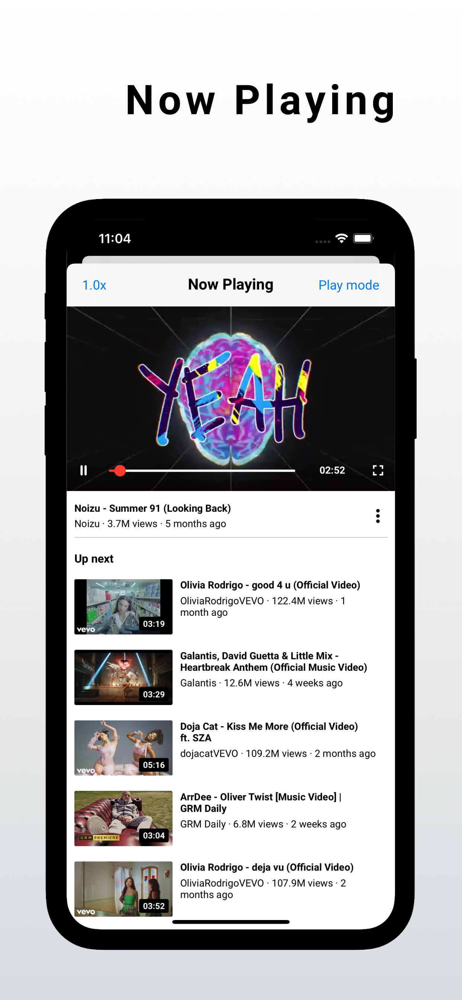
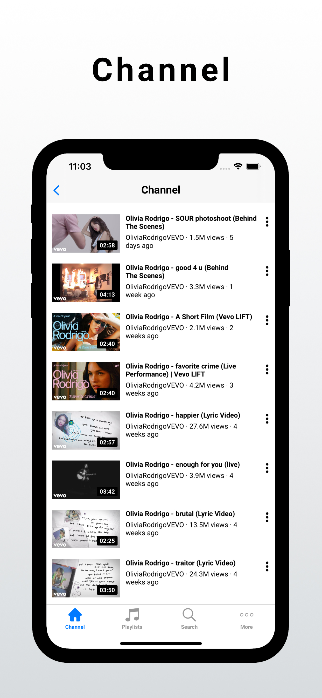

<!DOCTYPE html
    PUBLIC "-//W3C//DTD XHTML 1.0 Transitional//EN" "http://www.w3.org/TR/xhtml1/DTD/xhtml1-transitional.dtd">
<html xmlns="http://www.w3.org/1999/xhtml">

<head>
    <meta http-equiv="Content-Type" content="text/html; charset=UTF-8" />
    <meta name="viewport" content="width=320, initial-scale=1.0, maximum-scale=1.0" />
    <title>Sugar97% Studio | My Apps</title>

    <link rel="preconnect" href="https://fonts.gstatic.com">
    <link href="https://fonts.googleapis.com/css2?family=Roboto:wght@300&display=swap" rel="stylesheet">

    <link rel="stylesheet" href="./style.css">

    
</head>

<body>
    

        

            
My Apps

        

        <table style="width: 320px;">
            <td>
                

                <b style="margin-left: 10px; margin-right: 10px; font-weight: bold;">Tube Vanced</b>
                

                <b style="margin-left: 10px; margin-right: 10px; font-weight: normal;">Play music in the background</b>
            </td>
        </table>

         

        

            
            
            
            
            
            
            
        

        

            Tube is a free music application with many interesting features, giving you the best music experience on
            your mobile device.  

            Tube, which is constantly updated, will brings you a huge music collection with high quality and full of
            genres. You can easily approach playlists which are dominating the charts in many countries such as GB, JP,
            KR, US, VN ...  

            Tube owns a modern, smart music player with many interesting features:  

            - Tracking charts in many countries 
            - Search for favorite songs 
            - Customizing your playlist 
            - Playing videos in the background 
            - Support connecting with AirPods, AirPlay ...  

            Don't forget Tube keywords - a great music app for you.  

            <a href="https://play.google.com/store/apps/details?id=com.diutup.music">
                https://play.google.com/store/apps/details?id=com.diutup.music
            </a>
        

    

</body>

</html>
